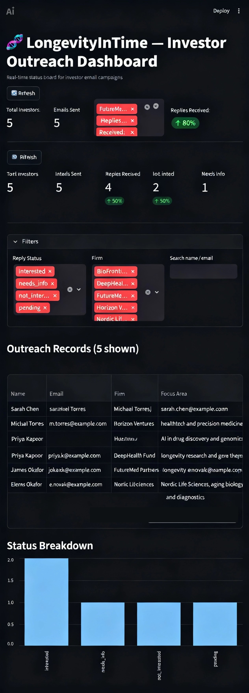

# Communication Agent System — LongevityInTime.org

## Dashboard Preview



Autonomous multi-agent communication system for investor outreach, scientific filings,
and regulatory submissions. Built with Python, FastAPI, Streamlit, GPT-4, and Resend.

---

## Quick Start

```bash
python3.11 -m venv .venv
source .venv/bin/activate
pip install -r requirements.txt
cp .env.example .env   # fill in your keys
```

### Configuration (`.env`)

| Variable | Description |
|---|---|
| `RESEND_API_KEY` | From [resend.com/api-keys](https://resend.com/api-keys) |
| `OPENAI_API_KEY` | Your OpenAI key |
| `WEBHOOK_SECRET` | Secret set in Resend webhook signatures |
| `WEBHOOK_API_KEY` | Optional; if set, required as header `X-Webhook-Api-Key` on `/tasks` |
| `USE_JSON_LOGGING` | Optional; set `1` or `true` for newline-delimited JSON logs |
| `FROM_EMAIL` | Verified sender (e.g. `outreach@longevityintime.org`) |
| `REPLY_TO_EMAIL` | Optional reply-to address for outbound emails |
| `IMAP_HOST`, `IMAP_USER`, `IMAP_PASSWORD`, `IMAP_FOLDER` | Optional inbox scanner for reply detection |
| `DB_URL` | SQLite path (default: `sqlite:///./outreach.db`) |
| `ARXIV_USERNAME` | arXiv account username (for SWORD v2 submission) |
| `ARXIV_PASSWORD` | arXiv account password |
| `USPTO_API_KEY` | From [data.uspto.gov](https://data.uspto.gov/myodp/landing) (free) |
| `FDA_CLIENT_ID` | FDA ESG NextGen OAuth client ID |
| `FDA_CLIENT_SECRET` | FDA ESG NextGen OAuth client secret |

### Domain Setup (LongevityInTime.org)

In Resend → Domains, add `longevityintime.org` and copy the DKIM/SPF DNS records
into your DNS provider. Resend verifies automatically within minutes.

---

## Running Tests

```bash
pytest tests/ -v
```

- **90 tests pass** with no API keys (all external calls mocked)
- **2 tests skip** until `pip install arxiv` (arXiv search only; `lxml` is in `requirements.txt`)

Secret scanning: `pre-commit` runs gitleaks on staged files; CI runs a full-history scan on every PR
(`.github/workflows/secret-scan.yml`).

---

## Project Structure

```
communication-agent/
├── core/
│   ├── llm.py                  # Shared OpenAI chat completion helper
│   ├── http.py                 # HTTP POST JSON with retries
│   └── logging_config.py       # Optional JSON log lines to stdout
├── orchestrator/
│   └── router.py               # Task dispatch (grant.* and session persistence)
├── config/
│   └── settings.py             # Pydantic settings (loads .env)
├── docs/
│   └── WORK_REPORT_VALIDATION.md  # Stakeholder fact-check vs external reviews
├── agents/
│   ├── email_agent.py          # MVP: Resend email sender + DB logging
│   ├── personalization.py      # MVP: GPT-4 Jinja2 email personalization
│   ├── intent_parser.py        # MVP: GPT-4 reply intent classifier
│   ├── grant_agent.py          # Grants.gov discovery + GPT-4 narrative draft
│   ├── preprint_agent.py       # arXiv SWORD v2 submission + bioRxiv prep
│   ├── journal_agent.py        # JATS XML builder + GPT-4 cover letter
│   ├── patent_agent.py         # USPTO prior art search + provisional draft
│   ├── dua_agent.py            # GPT-4 DUA drafting + data descriptor
│   └── fda_agent.py            # eCTD package builder + ESG NextGen upload
├── ind_validation/
│   ├── gate.py                 # Pre-ingestion IND validation gate (G1–G7)
│   ├── schema.py               # Manifest contract (generator ↔ packager)
│   └── cli.py                  # CLI: validate manifest + prose before packaging
├── models/
│   └── database.py             # OutreachRecord, AgentSession + SQLite
├── templates/
│   └── grants/
│       └── narrative_user_prompt.j2   # Grant narrative user prompt template
├── webhook/
│   ├── server.py               # FastAPI: /webhook, /tasks, /health
│   └── tasks.py                # In-process task queue (BackgroundTasks)
├── dashboard/
│   └── app.py                  # Streamlit status board
├── scripts/
│   └── run_outreach.py         # CLI outreach runner
├── tests/
│   ├── conftest.py             # Shared fixtures (in-memory SQLite)
│   ├── test_email_agent.py     # 6 tests
│   ├── test_intent_parser.py   # 8 tests
│   ├── test_personalization.py # 6 tests
│   ├── test_webhook.py         # Webhook + task API + health
│   ├── test_orchestrator.py    # Dispatch + AgentSession persistence
│   ├── test_roadmap_agents.py  # Roadmap agents (FDA/Journal XML with lxml)
│   └── test_ind_validation.py # IND pre-ingestion gate (G1–G7)
└── data/
    └── investors_sample.csv    # Sample investor list
```

---

## MVP — Investor Outreach (Fully Operational)

### 1. Run investor outreach

```bash
# Preview without sending
python -m scripts.run_outreach --csv data/investors_sample.csv --dry-run

# Send live emails
python -m scripts.run_outreach --csv data/investors.csv
```

CSV columns required: `name, email, firm, focus_area` (and optionally `notes`).

### 1b. Send news-triggered drafts from the bridge

Arshie's `scratch_longevity_agent` now queues drafted letters into this database.
Preview and send them from this project:

```bash
python -m scripts.send_drafted_outreach --dry-run
python -m scripts.send_drafted_outreach --limit 25
```

### 2. Start the webhook server

```bash
uvicorn webhook.server:app --host 0.0.0.0 --port 8000
```

Configure Resend → Webhooks to POST to `https://<your-domain>/webhook`
with event type `email.received`.

If replies land in a regular inbox instead, configure the `IMAP_*` variables and run:

```bash
python -m scripts.scan_replies --limit 50 --mark-seen
```

### 2b. Run follow-ups

This sends Day 3 and Day 7 bump emails only while `reply_status` is still `pending`.

```bash
python -m scripts.run_followups --dry-run
python -m scripts.run_followups --limit 50
```

### 3. Open the dashboard

```bash
streamlit run dashboard/app.py
```

---

## IND Validation Gate (ClickUp 86exujvxw)

Before any generated IND reaches the FDA agent, it must pass an automated validation gate.
The gate reads the **manifest JSON** (machine-readable contract from the research generator)
plus the IND **Markdown prose**, and hard-fails on fabrications, contradictions, and
placeholder leaks.

```bash
python -m ind_validation.cli --manifest path/to/manifest.json --prose path/to/ind.md
# exit 0 = passed, exit 1 = failed (packaging blocked)
```

`build_ectd_package(..., manifest=..., prose=...)` calls the same gate and raises if
`validation_status != passed`.

| Rule | What it blocks |
|---|---|
| **G1** | Non-real NCT/DOI/identifiers; clinical claims on placeholder drugs |
| **G2** | Placeholder tokens in sections marked `present` |
| **G3** | Drug mechanism mismatch between manifest and prose |
| **G4** | Phase 1 IND with Phase 2 efficacy claims |
| **G5** | Narrative hallmark coverage when scorecard ACS is zero |
| **G6** | Lowest-scoring hypothesis selected without override rationale |
| **G7** | Fabricated or unverified signatories |

**Accountability copy:** AI drafts and packages; named humans hold accountability at
regulatory gates. Do not use “Autonomous Investigator” on shipped regulatory artifacts.

---

## External Integrations — Live Verification Status

| Integration | Code path | Status |
|---|---|---|
| FDA ESG NextGen OAuth + presigned S3 | `agents/fda_agent.py` | **Implemented — pending live validation** (needs `FDA_CLIENT_ID` / `FDA_CLIENT_SECRET` sandbox run) |
| arXiv SWORD v2 submit | `agents/preprint_agent.py` | **Implemented — pending live validation** (needs arXiv account with SWORD enabled) |
| USPTO EFTS prior-art search | `agents/patent_agent.py` | **Implemented — pending live validation** (undocumented public endpoint; verify before investor demos) |

Uploading to ESG is **not** the same as filing an IND — commercial eCTD validation and
clinical review are still required.

---

## Roadmap Agents

### What is built and automated

| Agent | File | What it does automatically | What still needs a human |
|---|---|---|---|
| **Grant Agent** | `agents/grant_agent.py` | Searches Grants.gov REST API for live opportunities; queries NIH RePORTER; drafts Specific Aims with GPT-4 | SF424 submission via Grants.gov Workspace (requires institutional S2S digital certificate) |
| **Preprint Agent** | `agents/preprint_agent.py` | Submits manuscripts to **arXiv via SWORD v2** (fully automated); generates bioRxiv checklist + metadata | bioRxiv/medRxiv upload — web-form only, no API |
| **Journal Agent** | `agents/journal_agent.py` | Builds JATS 1.3 XML from article dict; drafts cover letter with GPT-4; exports submission package | Upload to Editorial Manager / ScholarOne portal — no public submission API |
| **Patent Agent** | `agents/patent_agent.py` | Searches USPTO full-text database for prior art; drafts provisional patent claims with GPT-4o | Filing via USPTO Patent Center (web-only). **Do not run against live portfolio matter without counsel.** Outputs go to git-ignored `output/patents/` only. |
| **DUA Agent** | `agents/dua_agent.py` | Drafts Data Use Agreement (GPT-4); drafts data access request letter; builds Frictionless Data descriptor | Institutional legal/IRB review and signatures required before execution |
| **FDA Agent** | `agents/fda_agent.py` | **IND validation gate** (G1–G7); builds eCTD directory + `index.xml` + MD5; zips; ESG NextGen OAuth + presigned S3 upload; polls status | eCTD validation with certified software (Lorenz, Extedo, Veeva) required before FDA accepts. Upload ≠ filed IND. |

---

### Grant Agent — what's still needed

**Status:** Discovery and drafting automated. Submission not possible via API.

| Step | Status | What's needed |
|---|---|---|
| Opportunity search (Grants.gov) | Done | — |
| Landscape analysis (NIH RePORTER) | Done | — |
| GPT-4 narrative / Specific Aims | Done | — |
| SF424 form auto-fill | Not done | `zeep` + SOAP/XML + institutional S2S certificate |
| Submission to Grants.gov | Not automatable | Register at grants.gov, obtain digital certificate (institutional process) |

**To file:** Save narrative from `grant_agent.save_application()`, paste into
Grants.gov Workspace, complete the SF424 R&R fields manually.

---

### Preprint Agent — what's still needed

**Status:** arXiv fully automated. bioRxiv/medRxiv prep only.

| Step | Status | What's needed |
|---|---|---|
| arXiv SWORD v2 submission | Done | `ARXIV_USERNAME` + `ARXIV_PASSWORD` in `.env`; SWORD access enabled on account |
| arXiv search | Done | `pip install arxiv` |
| bioRxiv/medRxiv metadata prep | Done | — |
| bioRxiv/medRxiv submission | Not automatable | Manual upload at biorxiv.org — no public API |

**To submit arXiv:**
```python
from agents.preprint_agent import submit_to_arxiv
submission_id = submit_to_arxiv(metadata, "paper.tar.gz")
```

**To prepare bioRxiv:** use the generated `biorxiv_metadata.md` and
`biorxiv_checklist.md` to complete the web form at biorxiv.org.

---

### Journal Agent — what's still needed

**Status:** Document preparation automated. Submission not possible via API.

| Step | Status | What's needed |
|---|---|---|
| JATS 1.3 XML generation | Done | `pip install lxml` |
| GPT-4 cover letter | Done | — |
| Submission package export | Done | `pip install lxml` |
| Editorial Manager API | Not automatable | No public API |
| ScholarOne API | Not automatable | Requires Clarivate vendor agreement |

**To submit:** Use files in `output/journal/` — upload `manuscript.jats.xml`
(or your PDF) and `cover_letter.txt` to the journal's submission portal.

---

### Patent Agent — what's still needed

**Status:** Prior art search and drafting automated. Filing not possible via API.

| Step | Status | What's needed |
|---|---|---|
| USPTO prior art search (EFTS) | Done | No API key needed |
| USPTO ODP search (enhanced) | Done | Optional: `USPTO_API_KEY` |
| GPT-4 provisional patent draft | Done | — |
| Filing via Patent Center | Not automatable | Authenticated web session at patentcenter.uspto.gov; attorney review recommended |

**To file:** Open `output/patents/<title>_provisional.md`, convert to PDF,
file at patentcenter.uspto.gov. Filing fee ~$320 (micro-entity) as of 2026.

---

### DUA Agent — what's still needed

**Status:** Drafting automated. Execution always requires human + institutional approval.

| Step | Status | What's needed |
|---|---|---|
| GPT-4 DUA draft | Done | — |
| Data access request letter | Done | — |
| Frictionless Data descriptor | Done | — |
| Legal review | Always required | Institutional legal/compliance team |
| IRB approval | Always required | IRB office |
| Signatures | Always required | Authorized representatives of both institutions |

**To use:** Call `dua_agent.save_dua_package()` → send request letter to data custodian →
share DUA draft with your legal team for review.

---

### FDA Agent — what's still needed

**Status:** eCTD package construction and ESG upload automated. Validation tool required.

| Step | Status | What's needed |
|---|---|---|
| eCTD directory structure + index.xml | Done | `pip install lxml` |
| MD5 checksum index | Done | — |
| Package zipping | Done | — |
| IND pre-ingestion validation gate (G1–G7) | Done | Pass `manifest` + `prose` to `build_ectd_package` |
| ESG NextGen OAuth authentication | Implemented — pending live validation | `FDA_CLIENT_ID` + `FDA_CLIENT_SECRET` |
| Presigned S3 upload | Implemented — pending live validation | — |
| Status polling | Implemented — pending live validation | — |
| eCTD validation | Not done (no open-source solution) | Lorenz docuBridge, Extedo eCTD manager, or Veeva Vault (all commercial) |
| ESG NextGen account | Required | Register at [esgng.fda.gov](https://esgng.fda.gov) |
| Clinical data (Module 5 content) | Required | Actual study reports, ADaM datasets in `.xpt` format (`pip install xport`) |

**To submit:**
```python
from agents.fda_agent import build_ectd_package, zip_ectd_package, get_esg_token, upload_to_esg
pkg = build_ectd_package(study_info)
zip_path = zip_ectd_package(pkg)
# Validate with commercial tool first, then:
token = get_esg_token()
submission_id = upload_to_esg(zip_path, token, "IND", "IND-123456")
```

---

## Install Optional Dependencies

After initial `pip install -r requirements.txt`, install these for full functionality:

```bash
# JATS XML + eCTD backbone construction
pip install lxml

# arXiv search and SWORD v2 submission
pip install arxiv

# SAS .xpt files for FDA Module 5 datasets
pip install xport

# AWS S3 for FDA ESG upload (if not using presigned URL flow)
pip install boto3
```
